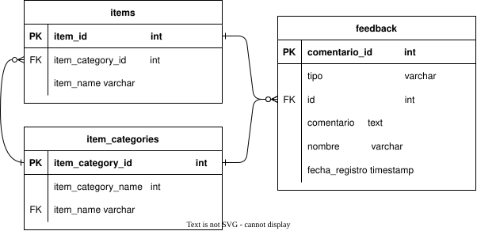

# Predictor de Ventas: 1C Company
Este es un MVP de un sistema que permite visualizar pronósticos de demanda de las ventas de la compañía 1C. El proyecto está hecho para ser desplegado en AWS en una URL pública implementando una interfaz en Streamlit.


## Datos
Los datos se obtuvieron de la competencia [Predict Future Sales](https://www.kaggle.com/c/competitive-data-science-predict-future-sales) de Kaggle.


## Arquitectura propuesta
El programa implementa diferentes servicios de AWS en un *stack* de CloudFormation. En S3 se guardarán datos históricos de la compañía, se accederá a ellos guardando los esquemas en Glue y consultándolos con Athena. En ECR se registra el contenedor donde está la aplicación, este se despliega con ECS Fargate. La aplicación contiene una sección que permite enviar *feedback* sobre productos o categorías que presenten fallas en sus predicciones, los cuales se registran en RDS haciendo uso de las credenciales almacenadas en Secrets Manager. Los logs creados se pueden acceder mediante CloudWatch.


Para el registro de observaciones se guardará una única tabla con los siguientes campos:
- **comentario_id**: Identificador único para cada observación registrada.
- **tipo**: "Producto" o "Categoría" dependiendo de a qué referencia la observación.
- **id:** Identificador ya sea del producto o la categoría.
- **comentario:** Descripción del problema ingresada por el usuario.
- **nombre:** Nombre del analista que ingresó el comentario.
- **fecha_registro:** Fecha y hora en la que se registró el comentario.

En el siguiente diagrama de relación-entidad se muestran los campos y tipos de la tabla de feedback y de las tablas con las que tienen relación.



## Estructura del repositorio

```

├── README.md                            # Descripción general
├── pyproject.toml                       # Configuración de ambiente
├── uv.lock                              # Resolución de dependencias
│
├── data/                                # (No se incluye en el repositorio pero se asume esta estructura)
│   └── raw/                             # Datos sin procesar
│
├── artifacts/                           
│   └── models/                          # Almacena los modelos predictores
|
└── src/                                 # Código fuente para inferencia
    ├── common/                          
    │   ├── __init__.py
    │   └── logging_utils.py             
    │
    ├── preprocessing/                   
    │   ├── __init__.py
    │   ├── __main__.py                  
    │   ├── Dockerfile                   
    │   ├── preprocessing.py             
    │   └── test/
    │       ├── __init__.py
    │       └── test_train.py            
    │
    ├── training/                        
    │   ├── __init__.py
    │   ├── __main__.py           
    │   ├── Dockerfile                   
    │   ├── train.py                     
    │   └── test/
    │       ├── __init__.py
    │       └── test_train.py            
    │
    └── inference/                       
        ├── __init__.py
        ├── __main__.py                  
        ├── Dockerfile                   
        ├── inference.py                 
        └── test/
            ├── __init__.py
            └── test_inference.py        
```

## Cómo ejecutar el código para hacer pruebas locales
**Sincronizar uv**
```
uv sync
```

**Ejecutar un submódulo de src**
```
uv run python -m src.<nombre-submódulo>
```

