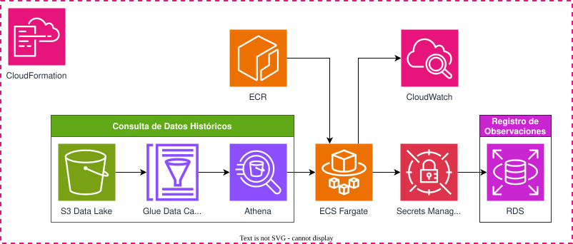
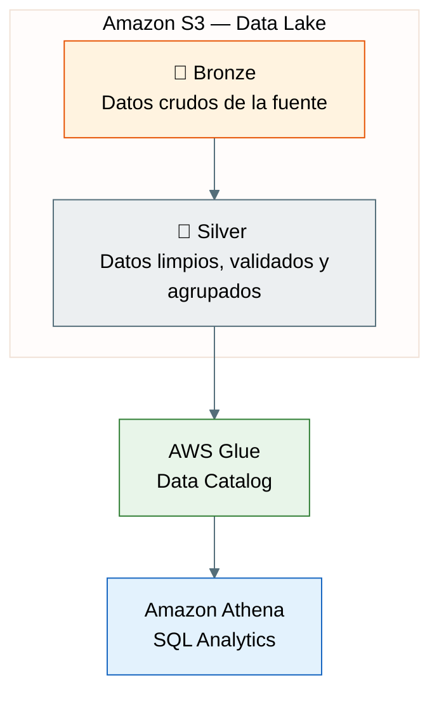
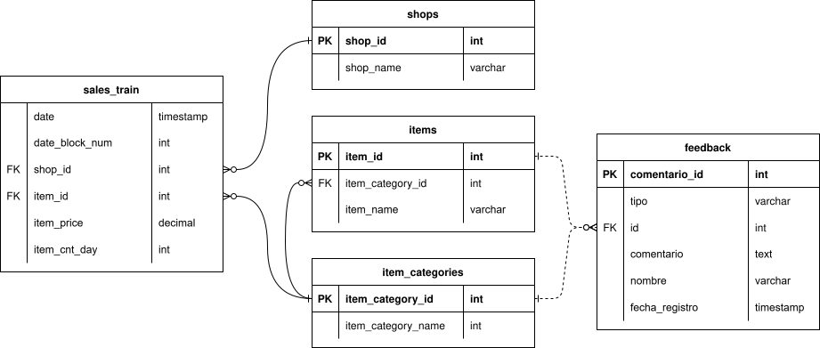
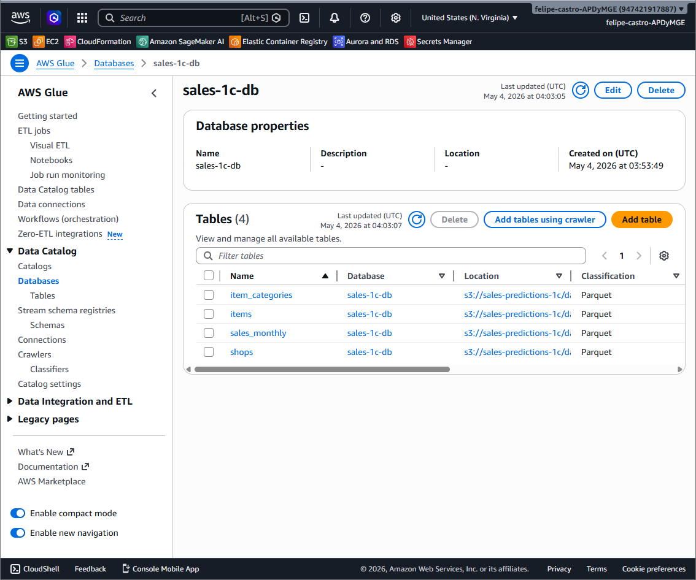

# Predictor de Ventas: 1C Company
Este es un MVP de un sistema que permite visualizar pronósticos de demanda de las ventas de la compañía 1C. El proyecto está hecho para ser desplegado en AWS en una URL pública implementando una interfaz en Streamlit.


## Datos
Los datos se obtuvieron de la competencia [Predict Future Sales](https://www.kaggle.com/c/competitive-data-science-predict-future-sales) de Kaggle.


## Propuesta de solución

### Arquitectura
El programa implementa diferentes servicios de AWS en un *stack* de CloudFormation. En S3 se guardarán datos históricos de la compañía, se accederá a ellos guardando los esquemas en Glue y consultándolos con Athena. En ECR se registra el contenedor donde está la aplicación, este se despliega con ECS Fargate. La aplicación contiene una sección que permite enviar *feedback* sobre productos o categorías que presenten fallas en sus predicciones, los cuales se registran en RDS haciendo uso de las credenciales almacenadas en Secrets Manager. Los logs creados se pueden acceder mediante CloudWatch.



### Organización de los datos
Hay dos estructuras que almacenan los datos: un **Data Lake** y una **RDS**.

El **Data Lake** almacena todos los datos históricos de ventas, así como información sobre productos, categorías y tiendas. Los datos se almacenan en dos capas:
-  **Bronze:** Se utiliza para guardar los todos los datos crudos de la empresa, sin modificaciones. Esta capa recibe todos los datos de ventas nuevos (la capa no está implementada actualmente).
-  **Silver:** Se utiliza para guardar datos limpios y validados. Estos datos los podemos utilizar para hacer consultas desde la aplicación de streamlit.

Por el momento, con una primera transformación y validación de los datos nos es suficiente por lo que no se incluye en el diseño una capa Gold.



El **RDS** se encarga del registro de observaciones, las cuales se guardarán una única tabla con los siguientes campos:
- **comentario_id**: Identificador único para cada observación registrada.
- **tipo**: "Producto" o "Categoría" dependiendo de a qué referencia la observación.
- **id:** Identificador ya sea del producto o la categoría.
- **comentario:** Descripción del problema ingresada por el usuario.
- **nombre:** Nombre del analista que ingresó el comentario.
- **fecha_registro:** Fecha y hora en la que se registró el comentario.

En el siguiente diagrama de relación-entidad se desglosa la relación entre todos las tablas de datos, independientemente de la estructura en la que se almacenan.



## Estructura del repositorio

```

├── README.md                            # Descripción general
├── pyproject.toml                       # Configuración de ambiente
├── uv.lock                              # Resolución de dependencias
│
├── data/                                # (No se incluye en el repositorio pero se asume esta estructura)
│   └── raw/                             # Datos sin procesar
│
├── artifacts/                           
│   └── models/                          # Almacena los modelos predictores
|
└── src/                                 # Código fuente para inferencia
    ├── common/                          
    │   ├── __init__.py
    │   └── logging_utils.py             
    │
    ├── preprocessing/                   
    │   ├── __init__.py
    │   ├── __main__.py                  
    │   ├── Dockerfile                   
    │   ├── preprocessing.py             
    │   └── test/
    │       ├── __init__.py
    │       └── test_train.py            
    │
    ├── training/                        
    │   ├── __init__.py
    │   ├── __main__.py           
    │   ├── Dockerfile                   
    │   ├── train.py                     
    │   └── test/
    │       ├── __init__.py
    │       └── test_train.py            
    │
    └── inference/                       
        ├── __init__.py
        ├── __main__.py                  
        ├── Dockerfile                   
        ├── inference.py                 
        └── test/
            ├── __init__.py
            └── test_inference.py        
```

## Evidencias
### Registro del catálogo de datos en AWS Glue
En esta imagen también se puede apreciar que los datos están guardados en un bucket de S3 como parquets. Se utilizó partición por mes para almacenar los datos de ventas agrupados.



## Cómo ejecutar el código para hacer pruebas locales
**Sincronizar uv**
```
uv sync
```

**Ejecutar un submódulo de src**
```
uv run python -m src.<nombre-submódulo>
```

